

# 🛡️ wepoc

### 现代化 Nuclei 漏洞扫描器图形界面工具

> 🚀 **基于 Wails v2 框架的现代化 Nuclei 漏洞扫描器图形界面工具**  
> 专为安全研究人员和渗透测试工程师设计

[📖 功能特性](#-功能特性) • [🚀 快速开始](#-快速开始) • [📚 使用指南](#-使用指南) • [🔧 开发文档](#-开发文档) • [🤝 贡献指南](#-贡献指南)

---

## 📖 项目简介

**wepoc** 是一个专为安全研究人员和渗透测试工程师设计的现代化漏洞扫描工具。

基于强大的 [Nuclei](https://github.com/projectdiscovery/nuclei) 扫描引擎，通过友好的图形界面让漏洞扫描变得更加简单高效。

### 🎯 设计理念

- **🎨 现代化界面** - 基于 React 18 + Ant Design 的现代化 UI
- **⚡ 高性能扫描** - 多任务并发，异步处理，任务间互不影响
- **🔧 易于使用** - 图形化界面，降低使用门槛
- **📊 详细分析** - 完整的扫描结果分析和报告

## ✨ 功能特性

### 🔍 核心功能一览

### 📁 模板管理

- ✅ **批量导入** Nuclei YAML 模板
- ✅ **智能验证** 和去重处理
- ✅ **高级筛选** 按关键词和严重等级
- ✅ **搜索分类** 模板管理

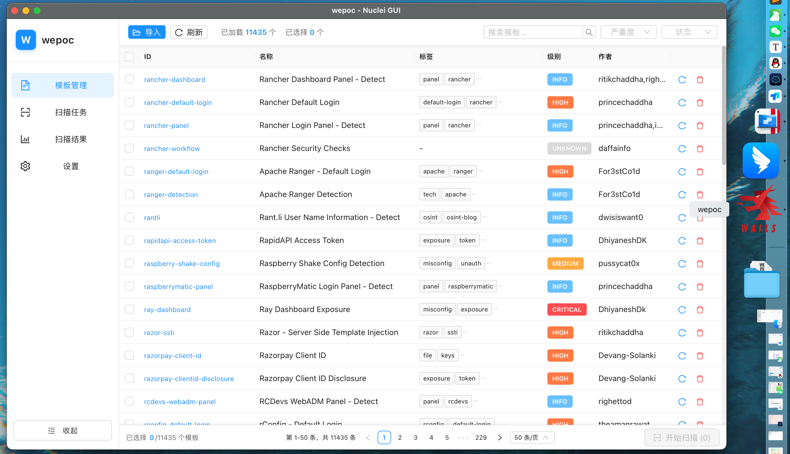

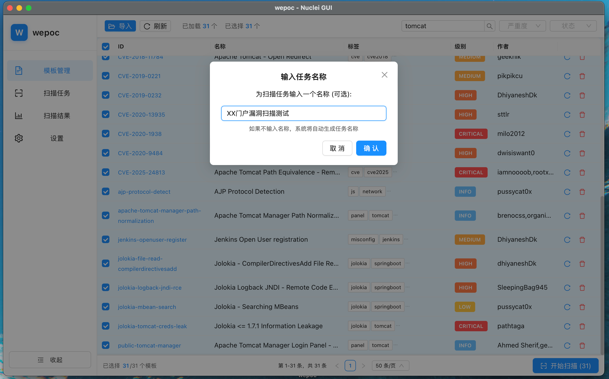

### 🎯 扫描任务

- ✅ **多任务并发** 异步处理
- ✅ **实时监控** 进度跟踪
- ✅ **任务重扫** 支持重新扫描
- ✅ **状态保持** 多选POC模板

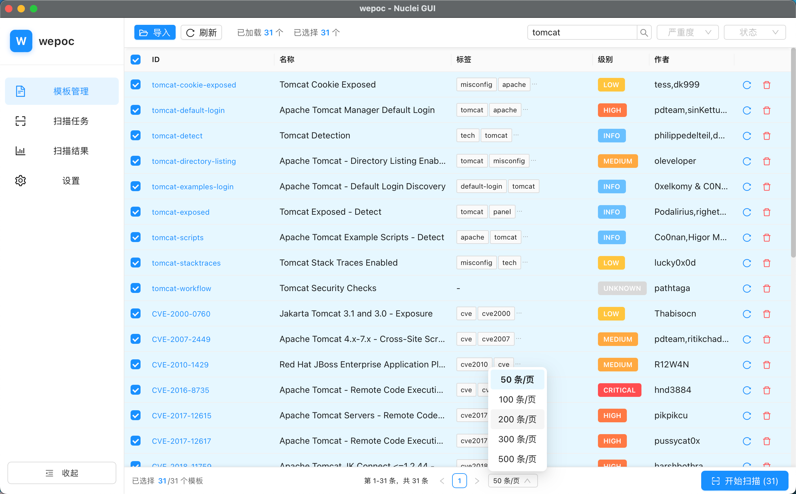

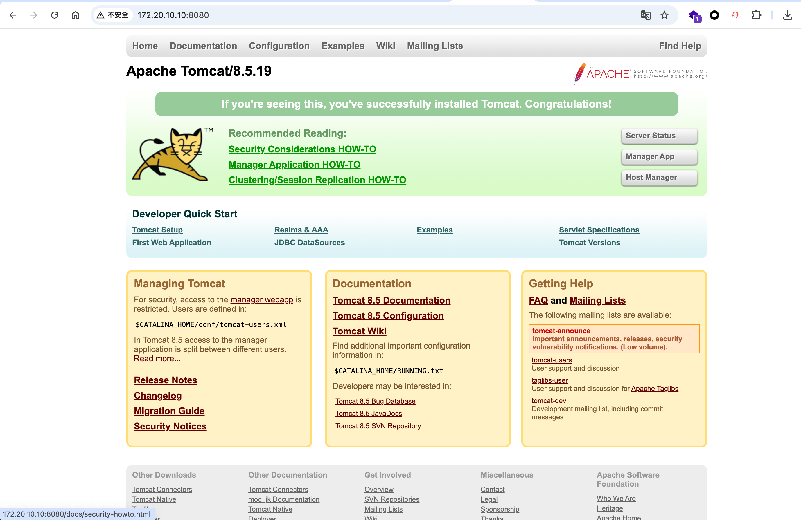

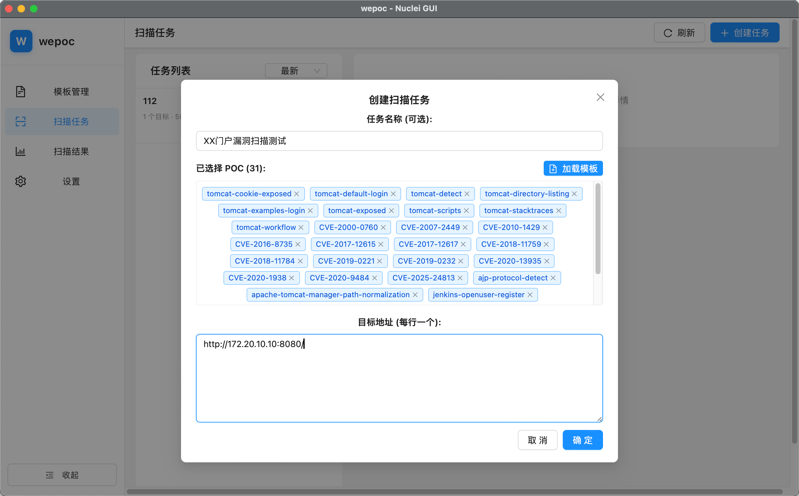

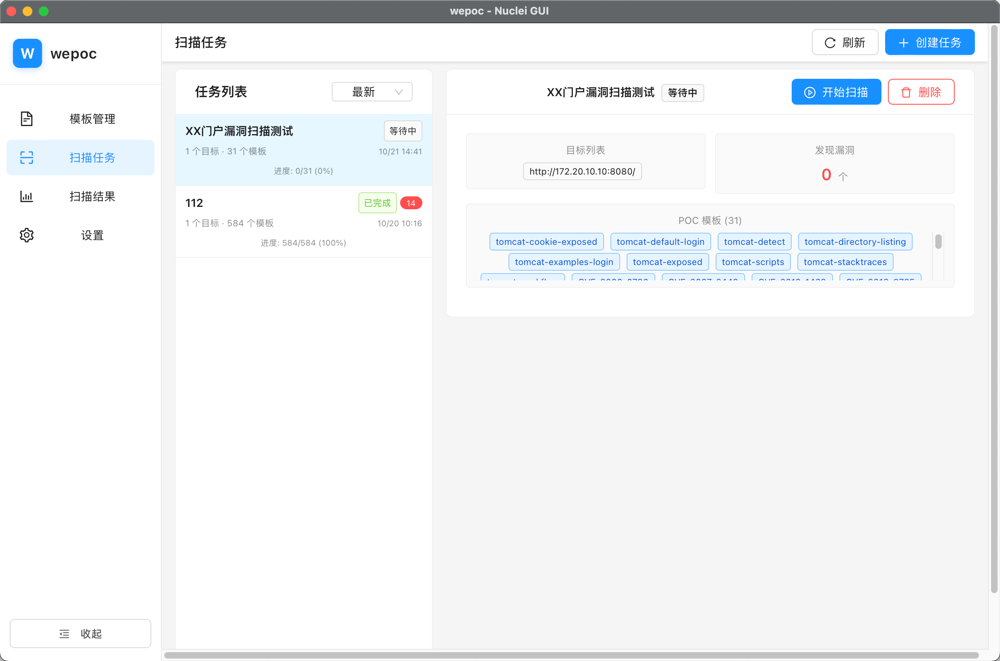

### 📊 结果分析

- ✅ **详细展示** 漏洞信息
- ✅ **请求响应** 数据查看
- ✅ **实时通知** 扫描结果

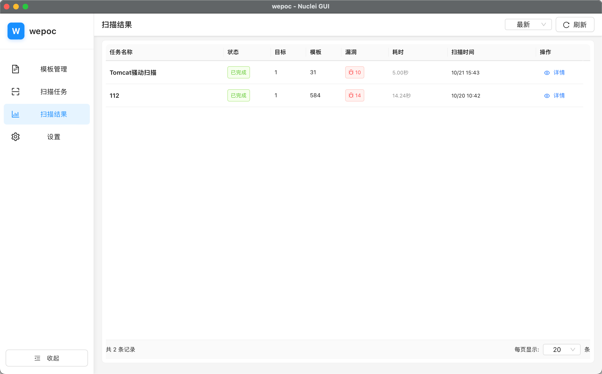

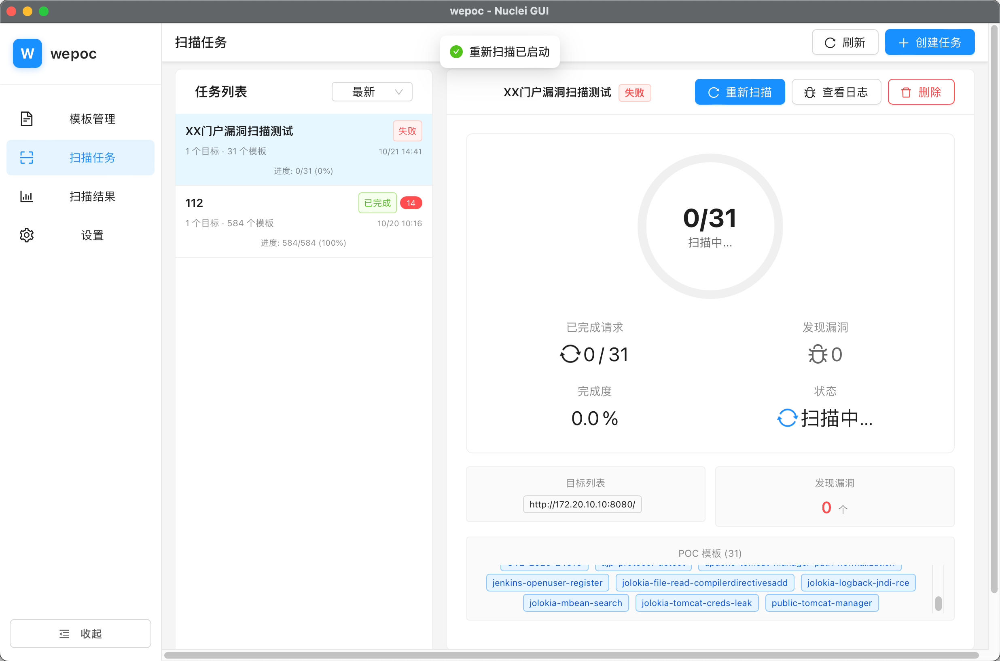

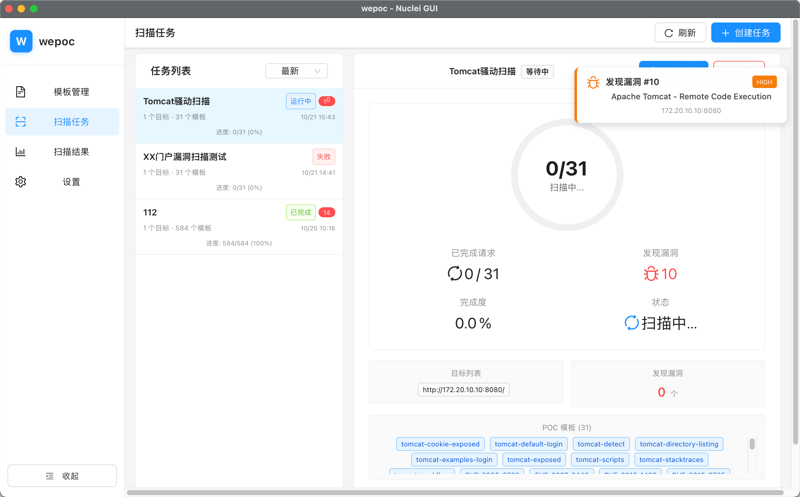

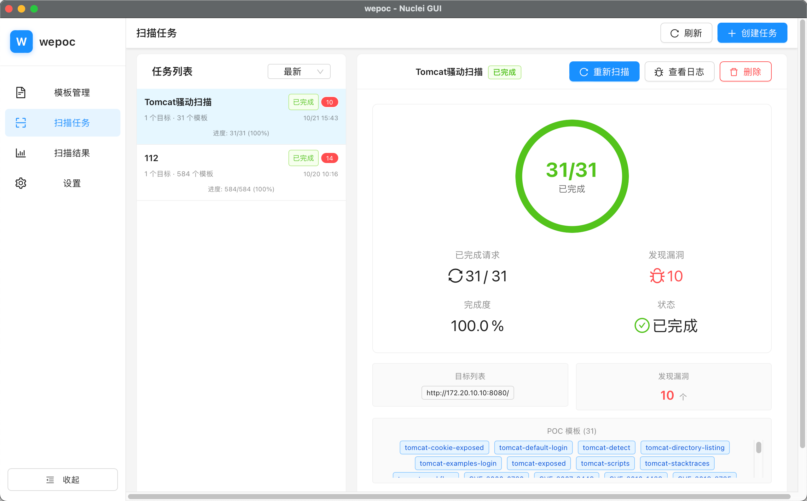

### ⚙️ 配置管理

- ✅ **POC导入** 增量导入
- ✅ **配置保存** 持久化设置
- ✅ **路径配置** Nuclei路径设置

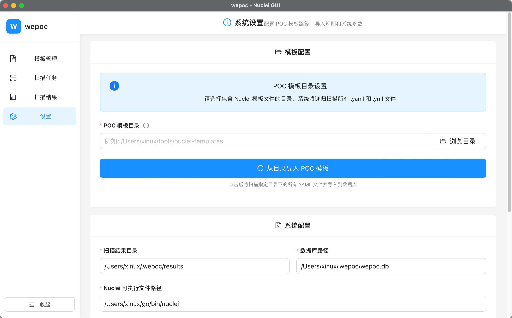

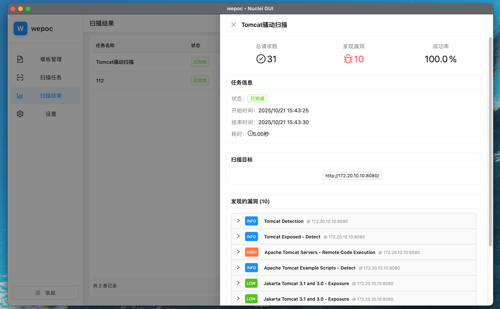

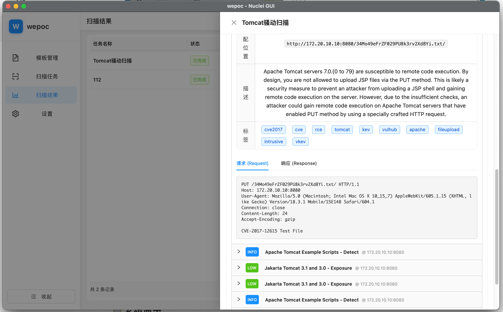

### 🚀 高级特性

| 特性 | 描述 | 状态 |
|------|------|------|
| 🔄 **多任务并发** | 异步多任务处理，任务间互不影响 | ✅ |
| 📈 **实时监控** | 扫描进度实时跟踪 | ✅ |
| 🔄 **任务重扫** | 支持任务重新扫描 | ✅ |
| 📱 **状态保持** | 切换页面不丢失选择状态 | ✅ |
| 🔔 **实时通知** | 扫描结果实时通知 | ✅ |

## 🚀 快速开始

### 📋 系统要求

| 操作系统 | 版本要求 | 状态 |
|---------|---------|------|
| 🪟 **Windows** | 10+ | ✅ 支持 |
| 🍎 **macOS** | 10.13+ | ✅ 支持 |
| 🐧 **Linux** | 主流发行版 | ✅ 支持 |

### 📦 安装方式

#### 🎯 方式一：预编译版本（推荐）

1. 📥 **下载安装包**
   - 访问 [Releases](https://github.com/cyber0s/wepoc/releases) 页面
   - 选择对应操作系统的安装包

2. 🔧 **安装应用**
   - Windows: 运行 `.exe` 安装程序
   - macOS: 拖拽到应用程序文件夹
   - Linux: 解压并运行可执行文件

### 🎮 首次使用

#### 📋 使用步骤

### 1️⃣ 启动应用

- 🚀 运行 wepoc 应用程序
- 📜 阅读并同意法律协议
- ⚙️ 配置 Nuclei 路径

### 2️⃣ 导入模板

- 📁 导入 Nuclei 模板库
- 🔍 选择自定义模板
- ✅ 验证模板有效性

### 3️⃣ 开始扫描

- 🎯 创建扫描任务
- 📊 实时监控进度
- 🔍 查看扫描结果

### 🎯 创建扫描任务

#### 🔧 任务配置流程

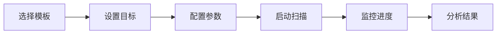

### 📁 选择模板

- ✅ 在模板管理页面选择 POC
- ✅ 支持多选和批量操作
- ✅ 按严重等级筛选

### 🎯 设置目标

- ✅ 输入目标 URL 或 IP
- ✅ 支持批量目标导入
- ✅ 自定义扫描参数

### 📊 结果分析

| 功能 | 描述 | 操作 |
|------|------|------|
| 🔍 **漏洞详情** | 查看完整漏洞信息 | 点击漏洞条目 |
| 📡 **请求响应** | 查看 HTTP 数据 | 展开详情面板 |
| 📝 **扫描日志** | 实时查看过程日志 | 打开日志窗口 |

### 🏗️ 技术架构

#### 🛠️ 技术栈

### 🖥️ 后端

- **Go** - 高性能后端语言
- **Wails v2** - 跨平台桌面框架
- **SQLite** - 轻量级数据库

### 🎨 前端

- **React 18** - 现代化前端框架
- **TypeScript** - 类型安全
- **Ant Design** - 企业级UI组件

### 🔍 扫描引擎

- **Nuclei v3** - 强大的漏洞扫描引擎
- **YAML模板** - 灵活的POC定义
- **多协议支持** - HTTP/HTTPS/其他协议

### 🔧 构建工具

- **Vite** - 快速构建工具
- **Wails** - 应用打包
- **Go Modules** - 依赖管理

### 🐛 报告问题

#### 📝 问题反馈

- 📋 **详细描述** - 提供详细的复现步骤
- 🖥️ **环境信息** - 操作系统、版本等
- 📸 **截图日志** - 附上相关的日志和截图
- 🏷️ **标签分类** - 使用合适的标签分类问题

## 📄 许可证

本项目采用 [GPL-3.0 License](LICENSE) 许可证。

## ⚠️ 免责声明

### ⚖️ 法律声明

> **⚠️ 重要提示**：本工具仅用于合法的安全测试和研究目的。

| 要求 | 说明 |
|------|------|
| 📜 **遵守法律** | 遵守当地法律法规 |
| 🔐 **授权测试** | 仅在获得明确授权的系统上测试 |
| ⚖️ **承担责任** | 承担使用本工具的全部法律责任 |
| 🚫 **禁止滥用** | 不得将本工具用于非法活动 |

**开发者不对使用本工具可能产生的任何法律后果承担责任。**

## 🙏 致谢

### 🎉 特别感谢

### 🔍 [Nuclei](https://github.com/projectdiscovery/nuclei)

强大的漏洞扫描引擎

### 🖥️ [Wails](https://wails.io/)

优秀的跨平台桌面应用框架

### 🎨 [Ant Design](https://ant.design/)

企业级 UI 组件库

### ⚛️ [React](https://reactjs.org/)

现代化的前端框架

---

**⭐ 如果这个项目对你有帮助，请给我们一个 Star！**

