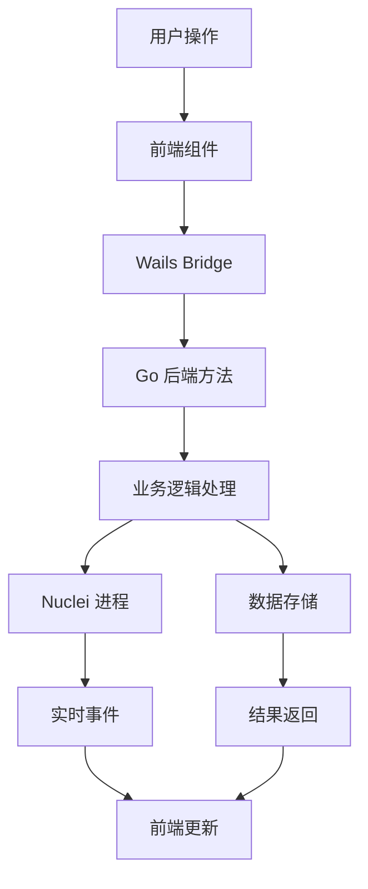

# wepoc - Nuclei 漏洞扫描器图形界面工具

<div align="center">


**高性能的 Nuclei 漏洞扫描器图形界面工具**

[功能特性](#功能特性) • [快速开始](#快速开始) • [架构设计](#架构设计) • [使用指南](#使用指南) • [开发指南](#开发指南)

</div>

## 📋 目录

- [项目简介](#项目简介)
- [功能特性](#功能特性)
- [技术栈](#技术栈)
- [快速开始](#快速开始)
- [架构设计](#架构设计)
- [使用指南](#使用指南)
- [开发指南](#开发指南)
- [构建部署](#构建部署)
- [贡献指南](#贡献指南)
- [许可证](#许可证)

## 🎯 项目简介

**wepoc** 是一个基于 Wails v2 框架开发的 Nuclei 漏洞扫描器图形界面工具。它提供了友好的 GUI 界面来管理 Nuclei POC 模板、创建扫描任务并查看扫描结果，让安全研究人员和渗透测试人员能够更高效地使用 Nuclei 进行漏洞扫描。

### 核心优势

- 🚀 **高性能**: 基于 Go 后端，支持多任务并行扫描
- 🎨 **现代化界面**: React + Ant Design 构建的美观界面
- 📊 **实时监控**: 实时进度跟踪和结果展示
- 🔧 **易于使用**: 图形化操作，无需命令行经验
- 📁 **模板管理**: 完整的 POC 模板导入、验证和管理功能
- 💾 **数据持久化**: SQLite 数据库 + JSON 文件双重存储

## ✨ 功能特性

### 🔍 模板管理
- ✅ **智能导入**: 支持批量导入 Nuclei POC 模板
- ✅ **模板验证**: 自动验证模板语法和格式
- ✅ **搜索过滤**: 按关键词、严重等级、标签等条件搜索
- ✅ **模板删除**: 支持从文件系统和数据库中删除模板
- ✅ **进度显示**: 实时显示导入进度和统计信息

### 🎯 扫描任务
- ✅ **任务创建**: 灵活配置扫描目标和 POC 模板
- ✅ **并行扫描**: 支持多个任务同时运行
- ✅ **实时监控**: 实时显示扫描进度和状态
- ✅ **任务管理**: 启动、暂停、停止、删除任务
- ✅ **重新扫描**: 支持使用相同配置重新发起扫描

### 📊 结果查看
- ✅ **结果展示**: 详细的漏洞发现结果展示
- ✅ **日志查看**: 完整的扫描日志和调试信息
- ✅ **数据导出**: 支持结果数据的导出和分享
- ✅ **统计信息**: 扫描统计和性能指标

### ⚙️ 配置管理
- ✅ **路径配置**: 自定义 Nuclei 路径、POC 目录等
- ✅ **性能调优**: 并发数、超时时间等参数配置
- ✅ **自动导入**: 支持从配置目录自动导入模板

## 🛠️ 技术栈

### 后端技术
- **Go 1.24+**: 高性能后端服务
- **Wails v2**: 跨平台桌面应用框架
- **SQLite**: 轻量级数据库存储
- **Nuclei v3**: 漏洞扫描引擎

### 前端技术
- **React 18**: 现代化前端框架
- **TypeScript**: 类型安全的 JavaScript
- **Ant Design 5**: 企业级 UI 组件库
- **React Router**: 单页应用路由
- **Vite**: 快速构建工具

### 核心依赖
```go
// 主要 Go 依赖
github.com/wailsapp/wails/v2 v2.10.2
modernc.org/sqlite v1.39.1
gopkg.in/yaml.v3 v3.0.1
```

```json
// 主要前端依赖
{
  "react": "^18.2.0",
  "antd": "^5.27.5",
  "react-router-dom": "^7.9.4",
  "typescript": "^4.6.4"
}
```

## 🚀 快速开始

### 环境要求

- **Go**: 1.24 或更高版本
- **Node.js**: 16 或更高版本
- **Nuclei**: v3 版本（必需依赖）
- **操作系统**: macOS、Windows、Linux

### 安装步骤

#### 1. 克隆项目
```bash
git clone <repository-url>
cd wepoc
```

#### 2. 安装 Nuclei（必需）
```bash
# 安装最新版本的 Nuclei
go install -v github.com/projectdiscovery/nuclei/v3/cmd/nuclei@latest

# 验证安装
nuclei -version
```

#### 3. 安装后端依赖
```bash
# 安装 Go 依赖
go mod tidy

# 如果需要代理（可选）
export https_proxy=http://127.0.0.1:7890
export http_proxy=http://127.0.0.1:7890
export all_proxy=socks5://127.0.0.1:7890
```

#### 4. 安装前端依赖
```bash
cd frontend
npm install
cd ..
```

#### 5. 启动开发服务器
```bash
# 启动开发模式（带热重载）
wails dev

# 如果 wails 命令不在 PATH 中
/Users/your-username/go/bin/wails dev
```

#### 6. 构建生产版本
```bash
# 构建当前平台版本
wails build

# 交叉编译（macOS 和 Windows）
wails build -platform darwin/amd64
wails build -platform windows/amd64
```

## 🏗️ 架构设计

### 整体架构

```
┌─────────────────────────────────────────────────────────────┐
│                        wepoc 应用架构                        │
├─────────────────────────────────────────────────────────────┤
│  前端层 (React + TypeScript + Ant Design)                   │
│  ┌─────────────┬─────────────┬─────────────┬─────────────┐   │
│  │ 模板管理    │ 扫描任务    │ 结果查看    │ 配置设置    │   │
│  └─────────────┴─────────────┴─────────────┴─────────────┘   │
├─────────────────────────────────────────────────────────────┤
│  Wails Bridge (前后端通信桥梁)                              │
├─────────────────────────────────────────────────────────────┤
│  后端层 (Go)                                                │
│  ┌─────────────┬─────────────┬─────────────┬─────────────┐   │
│  │ 应用层      │ 业务逻辑层  │ 数据访问层  │ 外部服务层  │   │
│  │ (app.go)    │ (scanner/)  │ (database/) │ (Nuclei)    │   │
│  └─────────────┴─────────────┴─────────────┴─────────────┘   │
├─────────────────────────────────────────────────────────────┤
│  数据存储层                                                 │
│  ┌─────────────┬─────────────┐                             │
│  │ SQLite 数据库│ JSON 文件   │                             │
│  │ (模板数据)   │ (任务数据)  │                             │
│  └─────────────┴─────────────┘                             │
└─────────────────────────────────────────────────────────────┘
```

### 核心模块

#### 1. 应用层 (`app.go`)
- **配置管理**: 应用配置的加载和保存
- **模板管理**: POC 模板的导入、验证、删除
- **任务管理**: 扫描任务的创建、启动、监控
- **结果处理**: 扫描结果的处理和展示

#### 2. 业务逻辑层 (`internal/scanner/`)
- **JSONTaskManager**: 基于 JSON 文件的轻量级任务管理
- **TemplateParser**: POC 模板解析和验证
- **SimpleNucleiScanner**: Nuclei 进程调用和输出解析
- **LogParser**: 实时日志解析和事件生成

#### 3. 数据访问层 (`internal/database/`)
- **Database**: SQLite 数据库操作封装
- **Templates**: 模板数据 CRUD 操作
- **Tasks**: 任务数据管理（旧版）

#### 4. 配置管理 (`internal/config/`)
- **Config**: 应用配置结构定义
- **配置加载**: 默认配置和用户配置管理
- **目录管理**: 自动创建必要的目录结构

### 数据流



## 📖 使用指南

### 首次使用

1. **启动应用**: 运行 `wails dev` 或双击可执行文件
2. **配置 Nuclei**: 在设置页面配置 Nuclei 可执行文件路径
3. **导入模板**: 在模板管理页面导入 Nuclei POC 模板
4. **创建任务**: 在扫描任务页面创建新的扫描任务
5. **查看结果**: 在结果页面查看扫描结果和漏洞详情

### 模板管理

#### 导入模板
1. 点击"导入模板"按钮
2. 选择包含 Nuclei 模板的目录
3. 系统会自动验证模板格式
4. 确认导入有效的模板

#### 搜索和过滤
- **关键词搜索**: 在搜索框中输入模板名称或描述
- **严重等级过滤**: 选择 Critical、High、Medium、Low、Info
- **标签过滤**: 按模板标签进行筛选

#### 删除模板
1. 选择要删除的模板
2. 点击删除按钮
3. 确认删除操作（会同时删除文件系统和数据库记录）

### 扫描任务

#### 创建任务
1. 点击"创建任务"按钮
2. 输入任务名称
3. 选择要使用的 POC 模板
4. 输入扫描目标（支持 URL、IP、域名）
5. 点击"创建任务"

#### 任务管理
- **启动任务**: 点击"启动"按钮开始扫描
- **暂停任务**: 暂停正在运行的任务
- **停止任务**: 完全停止任务执行
- **重新扫描**: 使用相同配置重新发起扫描
- **删除任务**: 删除任务记录和相关文件

#### 实时监控
- **进度条**: 显示扫描完成百分比
- **统计信息**: 显示已完成请求数、发现漏洞数
- **日志查看**: 实时查看扫描日志和调试信息

### 结果查看

#### 漏洞详情
- **基本信息**: 漏洞名称、严重等级、描述
- **技术详情**: 请求/响应数据、匹配位置
- **修复建议**: 漏洞修复和防护建议

#### 数据导出
- **JSON 格式**: 导出完整的扫描结果
- **CSV 格式**: 导出漏洞统计信息
- **报告生成**: 生成详细的扫描报告

### 配置设置

#### 基本配置
- **Nuclei 路径**: 指定 Nuclei 可执行文件位置
- **POC 目录**: 设置模板存储目录
- **结果目录**: 设置扫描结果输出目录

#### 性能配置
- **最大并发数**: 设置同时运行的任务数量
- **请求超时**: 设置单个请求的超时时间
- **重试次数**: 设置失败请求的重试次数

## 🛠️ 开发指南

### 开发环境设置

#### 1. 安装开发工具
```bash
# 安装 Wails CLI
go install github.com/wailsapp/wails/v2/cmd/wails@latest

# 安装前端开发工具
npm install -g typescript vite
```

#### 2. 项目结构
```
wepoc/
├── app.go                 # 主应用文件
├── main.go               # 程序入口
├── wails.json            # Wails 配置
├── go.mod                # Go 模块文件
├── frontend/             # 前端代码
│   ├── src/
│   │   ├── App.tsx       # 主应用组件
│   │   ├── components/   # 通用组件
│   │   ├── pages/        # 页面组件
│   │   ├── services/     # API 服务
│   │   └── types/        # 类型定义
│   └── package.json      # 前端依赖
└── internal/             # 内部包
    ├── config/           # 配置管理
    ├── database/         # 数据库操作
    ├── models/           # 数据模型
    └── scanner/          # 扫描器逻辑
```

### 开发工作流

#### 1. 添加新的后端方法
```go
// 在 app.go 中添加公开方法
func (a *App) NewMethod() error {
    // 实现逻辑
    return nil
}
```

#### 2. 生成前端绑定
```bash
# 生成 TypeScript 绑定文件
wails generate module
```

#### 3. 前端调用后端方法
```typescript
import { NewMethod } from '../../wailsjs/go/main/App';

const result = await NewMethod();
```

#### 4. 事件通信
```go
// 后端发送事件
runtime.EventsEmit(a.ctx, "event-name", data)
```

```typescript
// 前端监听事件
import { EventsOn } from '../../wailsjs/runtime/runtime';

EventsOn('event-name', (data) => {
    // 处理事件数据
});
```

### 代码规范

#### Go 代码规范
- 使用 `gofmt` 格式化代码
- 遵循 Go 官方代码规范
- 添加适当的注释和文档

#### TypeScript 代码规范
- 使用 ESLint 和 Prettier
- 遵循 React 最佳实践
- 使用 TypeScript 严格模式

### 测试

#### 后端测试
```bash
# 运行 Go 测试
go test ./...

# 运行特定包测试
go test ./internal/scanner
```

#### 前端测试
```bash
# 运行前端测试
cd frontend
npm test
```

### 调试

#### 开发模式调试
```bash
# 启动开发服务器
wails dev

# 查看日志输出
# 后端日志会在终端显示
# 前端日志在浏览器开发者工具中查看
```

#### 生产版本调试
```bash
# 构建调试版本
wails build -debug

# 运行并查看日志
./build/bin/wepoc
```

## 🚀 构建部署

### 本地构建

#### 开发版本
```bash
# 构建开发版本
wails dev
```

#### 生产版本
```bash
# 构建当前平台
wails build

# 构建并压缩
wails build -compress
```

### 交叉编译

#### macOS 版本
```bash
# Intel Mac
wails build -platform darwin/amd64

# Apple Silicon Mac
wails build -platform darwin/arm64
```

#### Windows 版本
```bash
# 64位 Windows
wails build -platform windows/amd64

# 32位 Windows
wails build -platform windows/386
```

#### Linux 版本
```bash
# 64位 Linux
wails build -platform linux/amd64

# ARM64 Linux
wails build -platform linux/arm64
```

### 构建选项

```bash
# 查看所有构建选项
wails build -help

# 常用选项
wails build \
  -platform windows/amd64 \
  -compress \
  -ldflags "-s -w" \
  -tags "release"
```

### 发布准备

#### 1. 版本管理
```bash
# 更新版本号
# 在 wails.json 中更新版本信息
# 在 package.json 中更新版本号
```

#### 2. 构建发布版本
```bash
# 构建所有平台版本
wails build -platform darwin/amd64
wails build -platform darwin/arm64
wails build -platform windows/amd64
wails build -platform linux/amd64
```

#### 3. 打包分发
```bash
# 创建发布目录
mkdir -p releases

# 复制构建文件
cp build/bin/wepoc.app releases/wepoc-macos.app
cp build/bin/wepoc.exe releases/wepoc-windows.exe
cp build/bin/wepoc releases/wepoc-linux
```

## 🤝 贡献指南

### 贡献方式

1. **Fork 项目**: 点击右上角的 Fork 按钮
2. **创建分支**: 创建新的功能分支
3. **提交代码**: 提交您的更改
4. **创建 PR**: 创建 Pull Request

### 贡献类型

- 🐛 **Bug 修复**: 修复已知问题
- ✨ **新功能**: 添加新功能
- 📚 **文档**: 改进文档和注释
- 🎨 **界面优化**: 改进用户界面
- ⚡ **性能优化**: 提升应用性能

### 提交规范

```bash
# 提交信息格式
<type>(<scope>): <description>

# 示例
feat(templates): add template validation
fix(scanner): resolve progress update issue
docs(readme): update installation guide
```

### 代码审查

- 确保代码符合项目规范
- 添加适当的测试用例
- 更新相关文档
- 确保所有测试通过

## 📄 许可证

本项目采用 MIT 许可证。详情请查看 [LICENSE](LICENSE) 文件。

## 🙏 致谢

- [Nuclei](https://github.com/projectdiscovery/nuclei) - 强大的漏洞扫描引擎
- [Wails](https://wails.io/) - 优秀的跨平台桌面应用框架
- [Ant Design](https://ant.design/) - 企业级 UI 设计语言
- [React](https://reactjs.org/) - 用户界面构建库

## 📞 联系方式

- **作者**: wepoc team
- **邮箱**: 5529699+code_xinux@user.noreply.gitee.com
- **项目地址**: [GitHub Repository](https://github.com/your-username/wepoc)

---

<div align="center">

**如果这个项目对您有帮助，请给个 ⭐ Star 支持一下！**

Made with ❤️ by wepoc team

</div>
